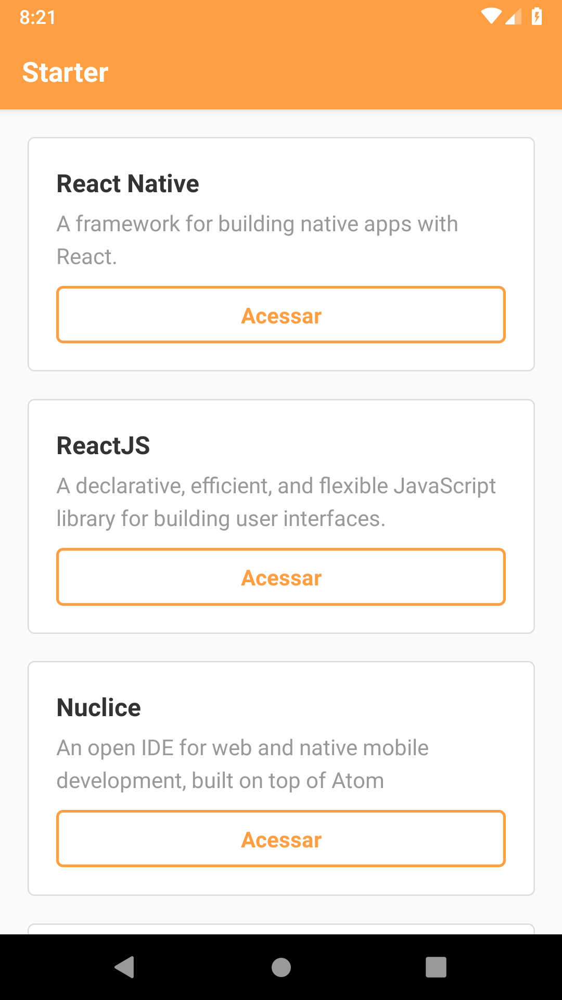
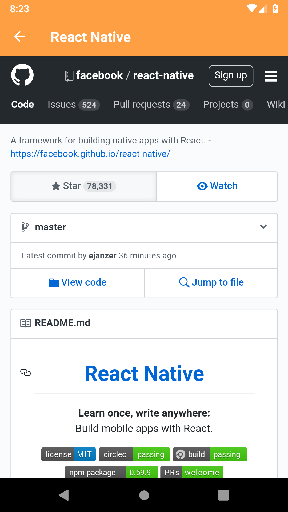

# React Native Starter
> This application is my first app ever built using react native.
It consumes a simple service made by folks at [Rocketseat](https://github.com/Rocketseat), that shows some git repositories, which can be accessed inside the application using webview.

## Preview
> Screenshot of current version of the app.




## Develop
It should be easy to develop, just install [react-native-cli](https://www.npmjs.com/package/react-native-cli) as global dependency, and all it's dependencies for building native apps, like [Android Build Tools](https://github.com/codepath/android_guides/wiki/Installing-Android-SDK-Tools) and [XCode](https://developer.apple.com/xcode/) (for building iOS apps on macOS).

Then, you are going to need a device, or a virtual device, to build and test the application. XCode already installs the iOS Simulator, but for Android, you need to create a new virtual device, or connect a real device with USB Debugging enabled.

After that, just run:
```sh
yarn # if using yarn
npm install # if using npm
react-native run-ios # For building and running on iOS simulator
react-native run-android # For building and running on Android Emulator
```

## Author

| |
|:---------------------:|
|  [Bruno Lombardi](https://github.com/bruno-lombardi)   |

## License

This project is licensed under the MIT License - see the [LICENSE.md](LICENSE.md) file for details